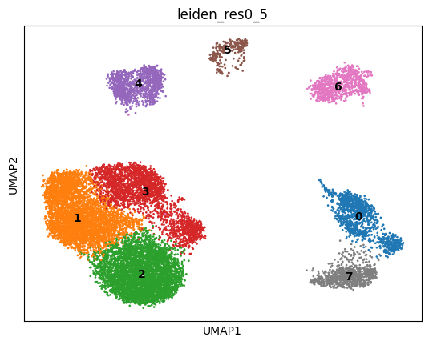
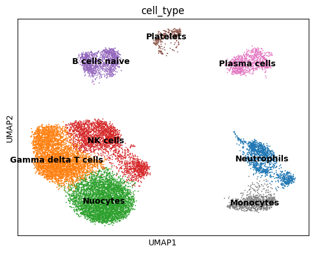

# Project Stage 2: Single-Cell RNA-Seq Analysis

#### Linkedin Link:https://www.linkedin.com/posts/adeyeye-daniel-366383120_hackbio-scrna-activity-7402300615042703361-4CLd?utm_source=share&utm_medium=member_desktop&rcm=ACoAAB30gj4BsG6qOFL2OkQFamVqH9bK0GUyXfA
#### Github Link: https://github.com/Tormiwah205/Hackbio_Stage_2_scRNA-seq/blob/main/Stage_2.ipynb

## Objective
To reproduce a core single-cell RNA-seq (scRNA-seq) analysis pipeline using **Scanpy**, annotate cell clusters from a blinded dataset labeled "Bone Marrow," and biologically validate the tissue of origin and the health status of the donor.

---

## Computational Workflow
The analysis was performed in a Jupyter Notebook environment using the standard **Scanpy** single-cell analysis framework.

### 1. Environment Setup
**Key Libraries:** `scanpy`, `anndata`, `decoupler` (for annotation), `scrublet` (doublet detection), `pandas`, `seaborn`.

### 2. Data Pre-processing & Quality Control (QC)
*   **QC Metrics:** Assessed distribution of gene counts, total counts (depth), and mitochondrial/ribosomal content.
*   **Thresholds Applied:**
    *   Mitochondrial genes (%MT) < 5% (to remove dying cells).
    *   Ribosomal genes (%RB) < 10% and Hemoglobin (%HB) < 5% (to minimize contamination).
*   **Doublet Removal:** Applied `scrublet` to identify and remove multiplet artifacts.

### 3. Normalization & Feature Selection
*   **Normalization:** Global scaling to standardize library size across cells.
*   **Feature Selection:** Identification of top 1,000 Highly Variable Genes (HVGs) to drive the clustering.

### 4. Dimensionality Reduction & Clustering
*   **PCA:** Principal Component Analysis for initial dimensionality reduction.
*   **Neighborhood Graph:** Computed using PCA representation.
*   **Clustering:** Leiden algorithm used to detect distinct cell populations.
*   **Visualization:** UMAP (Uniform Manifold Approximation and Projection).

### 5. Cell Annotation
*   **Method:** Automated annotation using **Decoupler** with the **PanglaoDB** marker set.
*   **Validation:** Cross-referenced top-scoring cell types per cluster with canonical marker gene expression (dot plots/heatmaps).

---

## Biological Findings: Cell Type Annotation

Eight distinct cell populations were identified. Below is the biological role of each cluster within the immune landscape:

| Cell Type | Biological Function |
| :--- | :--- |
| **Neutrophils** | Short-lived innate granulocytes. They act as the "first responders," utilizing phagocytosis and NETosis (neutrophil extracellular traps) to neutralize pathogens. |
| **(Gamma Delta) T Cells** | A specialized subset of T lymphocytes that bridge innate and adaptive immunity. They reside at barrier tissues and blood, rapidly responding to stress signals without MHC restriction. |
| **Nuocytes (ILC2s)** | Also known as **Group 2 Innate Lymphoid Cells**. They drive Type 2 inflammation (anti-helminth, allergic response) and tissue repair by secreting cytokines like IL-5 and IL-13. |
| **NK (Natural Killer) Cells** | Cytotoxic innate lymphocytes responsible for destroying virally infected cells and tumor cells via perforin/granzyme release, without prior sensitization. |
| **Naive B Cells** | Mature B lymphocytes that have not yet encountered their specific antigen. They circulate in the blood and lymph nodes, awaiting activation to differentiate. |
| **Plasma Cells** | Terminally differentiated B cells. They act as "antibody factories," secreting large volumes of immunoglobulins to neutralize specific pathogens. |
| **Monocytes** | Circulating myeloid cells involved in phagocytosis and cytokine production. They differentiate into macrophages or dendritic cells upon migrating into tissues. |
| **Platelets** | Anucleate fragments derived from megakaryocytes. Their primary role is hemostasis (clotting), but they also release inflammatory mediators during immune responses. |

| UMAP 1 | UMAP 2 |
| ------ | ------ |
|  |  |

---

## Biological Interpretation

### 1. Tissue of Origin: Rejection of "Bone Marrow" Hypothesis
Despite the dataset label, the cellular composition strongly suggests this sample is **Peripheral Blood**, not Bone Marrow.

*   **Absence of Progenitors:** Healthy bone marrow is defined by the presence of Hematopoietic Stem Cells (HSCs, CD34+) and lineage progenitors (e.g., Common Myeloid Progenitors, Pro-B cells, Megakaryoblasts). None of these immature populations were detected.
*   **Absence of Stromal Niche:** No mesenchymal stem cells (MSCs), osteoblasts, or CXCL12-abundant reticular (CAR) cells were found.
*   **Differentiation Status:** All identified clusters (Neutrophils, Monocytes, Naive B cells) exhibit a mature, circulating phenotype. In bone marrow, one would expect a gradient of differentiation (e.g., band cells, metamyelocytes), not exclusively mature cells.

**Conclusion:** The sample is a **Leukocyte-enriched Peripheral Blood** fraction (PBMCs with granulocytes retained).

### 2. Health Status: Active Immune Response / Infection
The donor appears to be undergoing an **active inflammatory event**, likely viral or Type-2 dominant.

*   **Lymphoid Expansion:** The dataset shows a dominance of lymphoid lineages ($\gamma\delta$ T cells, NK cells) over neutrophils. In healthy blood, neutrophils typically constitute 50-70% of leukocytes; here, their relative abundance is lower than expected, suggesting a "left shift" or lymphoid proliferation.
*   **Presence of ILC2s (Nuocytes):** ILC2s are typically tissue-resident (lungs, gut). Their detectable presence in the blood suggests systemic mobilization, often seen in allergic inflammation or respiratory viral infections.
*   **Activation Signatures:** The concurrent presence of **Plasma cells** (active antibody production) and cytotoxic effectors (**NK cells**, **$\gamma\delta$ T cells**) indicates the immune system is currently engaging a pathogen.

**Conclusion:** The patient is **Infected/Inflamed**. The specific profile (ILC2 + cytotoxic cells) points toward a viral etiology or an acute inflammatory exacerbation.

---

## Dependencies

| Package | Version |
| :--- | :--- |
| **scanpy** | 1.11.5 |
| **anndata** | 0.11.4 |
| **decoupler** | 2.1.2 |
| **scvi-tools** | 1.3.3 |
| **pandas** | 2.3.3 |
| **leidenalg** | 0.11.0 |

---

## References

1.  **Papayannopoulos, V.** (2018). Neutrophil extracellular traps in immunity and disease. *Nature Reviews Immunology*, 18(2), 134-147.
2.  **Holtmeier, W., & Kabelitz, D.** (2005). gammadelta T cells link innate and adaptive immune responses. *Chemical Immunology and Allergy*, 86, 151–183.
3.  **Halim, T. Y., et al.** (2015). Group 2 innate lymphoid cells in disease. *International Immunology*, 27(1), 11-21.
4.  **Fink, K.** (2012). Origin and Function of Circulating Plasmablasts during Acute Viral Infections. *Frontiers in Immunology*, 3, 78.
5.  **Lee, N. Y. S., et al.** (2023). Establishing a human bone marrow single cell reference atlas to characterize signal transduction and transcription factor activity. *Frontiers in Immunology*, 14.
6.  **Jardine, L., et al.** (2021). Blood and immune development in human fetal bone marrow and liver. *Nature*, 598(7880), 327-334.
7.  **PanglaoDB:** A database of cell type markers for single-cell RNA sequencing.
